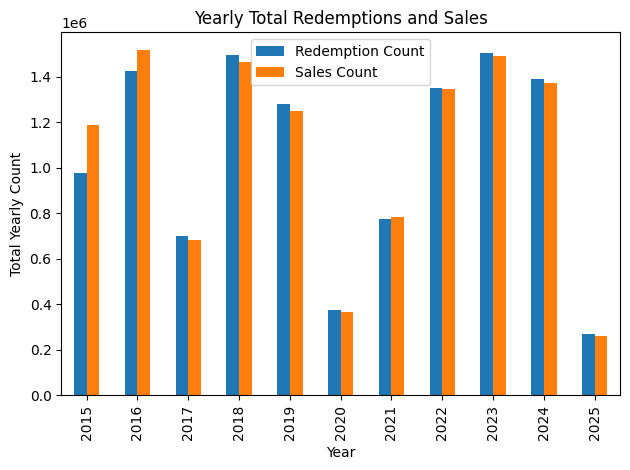

# Initial EDA Report: Ferry Ticket Data for Toronto Island

## Observations from Initial Data Exploration

- The dataset contains ferry ticket counts for Toronto Island.
- **Sales Count** is the number of tickets sold between the previous and current timestamp. This reflects customer *intention* to travel (ticket purchase).
- **Redemption Count** is the number of tickets actually redeemed (people who boarded the ferry) between the previous and current timestamp. This reflects actual usage.
- There are 246,425 observations and **no missing values**.
- If missing values were present:
  - For small proportions (<5%), we could drop them.
  - For larger gaps, we would use imputation (mean, median) depending on data distribution.

---

## Dataset Characteristics

- The dataset contains over 10 years of daily data (15-minute intervals) for "Sales Count" and "Redemption Count".
- The date range is **May 1, 2015** to **June 6, 2025**.
- Strong **yearly seasonal pattern**: visitor numbers rise during summer (May-August).
- **Pandemic period (2020–2021)** saw a drop in visitors due to lockdowns, restrictions, and limited ferry operations.
- Post-pandemic period shows return to normal seasonal behavior.
- A **strong correlation** between sales and redemption counts suggests most tickets are redeemed shortly after purchase.

### Figure 1: Daily Time Series of Ticket Redemption and Sales (May 2015 to June 2025)

  
> Figure 1 shows strong yearly seasonality in both ticket redemptions and sales, with sharp peaks during summer months. A noticeable drop is seen during the pandemic years (2020–2021), and a unique dip is evident in 2017.

### Figure 2: LOESS-Smoothed Seasonal Trend of Redemptions (2022–2024)

> In Figure 2, the red curve reveals the underlying seasonal pattern in ticket redemptions over three years. LOESS effectively captures smooth trends while adapting to local fluctuations, offering a clearer view of seasonal highs and lows compared to raw data.

---

## Yearly Pattern

- Visitor counts were significantly lower during 2020–2021.

- An unusual drop in visitors was observed in **2017**.

### Figure 3: Total Yearly Ticket Redemptions and Sales

  
> Figire 2 shows a pandemic-related dip in 2020–2021, and a major drop in 2017 likely caused by flooding on Toronto Island.

---

### Figure 4: Year-over-Year Percentage Change in Ticket Redemptions and Sales

  
> Figure 3 highlights the relative annual growth or decline in ticket usage. Sharp drops are seen in 2017 and 2020, with strong rebounds in 2018 and 2021.

---

#### Investigating the Unusual Drop in 2017 (Unrelated to Pandemic Cause)

- Was summer 2017 (May–September) colder?  
  ➤ **No** significant difference in temperature compared to 2016 and 2018.

  #### Table 1. Monthly Mean Temperatures (°C): 2016 to 2018

| Month     | 2016 | 2017 | 2018 |
|-----------|------|------|------|
| May       | 13.0 | 13.5 | 14.0 |
| June      | 18.5 | 19.0 | 20.0 |
| July      | 22.0 | 21.5 | 23.0 |
| August    | 21.5 | 21.0 | 22.5 |
| September | 17.0 | 17.5 | 18.0 |

- Was there more precipitation in 2017?  
  ➤ **No**, 2017 had comparable rainfall to surrounding years.

#### Table 2. Monthly Total Precipitation (mm): 2016 to 2018

| Month     | 2016 (mm)| 2017 (mm)| 2018 (mm)|
|-----------|------|------|------|
| May       | 52.0 | 75.0 | 66.0 |
| June      | 90.0 | 85.0 | 78.0 |
| July      | 65.0 | 70.0 | 88.0 |
| August    | 80.0 | 60.0 | 92.0 |
| September | 55.0 | 68.0 | 74.0 |

- **Key Insight**:  
  ➤ In Spring 2017, **Lake Ontario water levels rose significantly**, causing severe flooding across Toronto Islands.  
  ➤ April–May 2017 saw excessive rain and snowmelt in the Great Lakes region.
  ➤ **Centreville Amusement Park** didn't open in May and only partially reopened by July 31, 2017.  
  ➤ Ferry service was also disrupted due to flooding, reducing accessibility.

## Monthly Observations

- We observe a strong **monthly seasonality** - rise in May, peak in August, drop after September.

### Figure 5: Average Redemption and Sales Count by Month

  
> Figure 4 displays the average number of redemptions and sales for each calendar month, showing a clear peak during the summer (July & August) and a dip during winter months.

## Day of the week Observations

### Figure 6: Average Daily Redemption and Sales by Day of the Week

  
> Figure 5 shows that Weekends (especially Saturday) has significantly higher traffic than weekdays, reflecting recreational travel patterns.

---

### Figure 7: Percent Change from Weekly Average by Day of the Week

  
> Figure 6 visualizes the deviation in ticket counts from the weekly average. It reinforces that weekends (especially Saturday) are well above average, while Tuesday lags the most.

## References

[1] https://en.climate-data.org/north-america/canada/ontario/toronto-53/?utm_source=chatgpt.com  
[2] https://climate.weather.gc.ca/historical_data/search_historic_data_stations_e.html?StationID=48549&utm_source=chatgpt.com  
[3] https://www.toronto.ca/legdocs/mmis/2018/ex/bgrd/backgroundfile-112208.pdf?utm_source=chatgpt.com  
